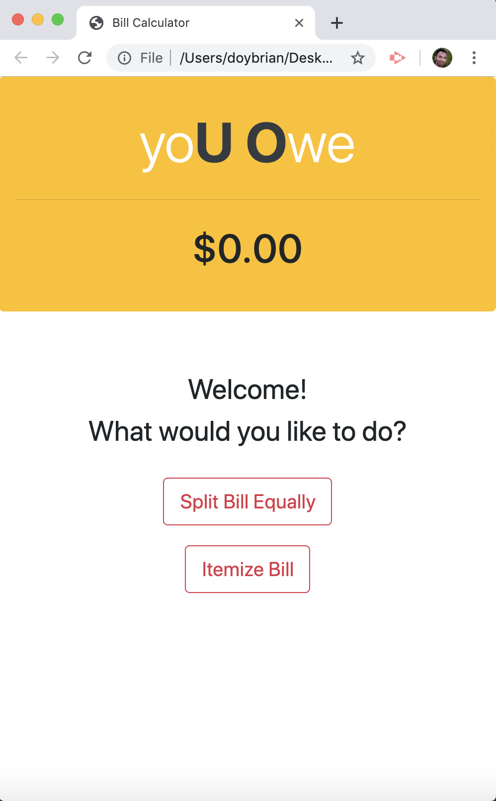

# yoU_Owe
A mobile-responsive web app for splitting or itemizing the tab or bill and calculating the tip.

## Deployed Link
https://doybrian.github.io/yoU_Owe/

### Design Plan

* Uses only front-end plain Javascript to function as a simple bill splitter or itemizer and tip calculator.

### Overview

* App will offer user the option to split the bill evenly or itemize the bill.

* When splitting the bill evenly:
    - App will ask for the total bill amount (assumes tax is already included).
    - Then it will proceed to ask the number of people splitting the bill. At this point, amount owed is calculated and shown.
    - It will then ask for tip choices by percentage (10, 15 and 20% are the only choices as these are believed to be acceptable). However, if service charge is already included (especially true for bigger parties), a button is available, then final amount owed is shown on the screen.
    - User also has the option to choose other amount, if they decide to customized the tip amount (other than the first 3 choices) or not tip at all which is highly discouraged.
    - A restart button is available at the end if necessary.

* When itemizing the total bill:
    - It will ask user to add price of a selected item from the bill (this price is usually without tax). User can add as many items and total will be updated accordingly on the screen.
    - If there is an item that was shared, a button can be clicked to calculate one's share of the said item. It will ask how many people are sharing the cost of the item and it will calculate one's share and add it to the total amount shown in the screen. After doing so, it will go back to the previous screen and if there are other shared items, the same button can be clicked to go through the same calculation process.
    - Once itemization is done, user can click the Done button.
    - App will then ask for the sales tax applied to the bill (in percentage, not in actual decimal value) and will update the total amount accordingly.
    - Then it will go through the same tip calculation as the other choice. Also a restart button will also pop up once the calculations are done.

* For future improvement, possibly use React js to render data without changing a lot of the code. Also, will add validation on user input so that data entered will always be valid for all the necessary calculations.

